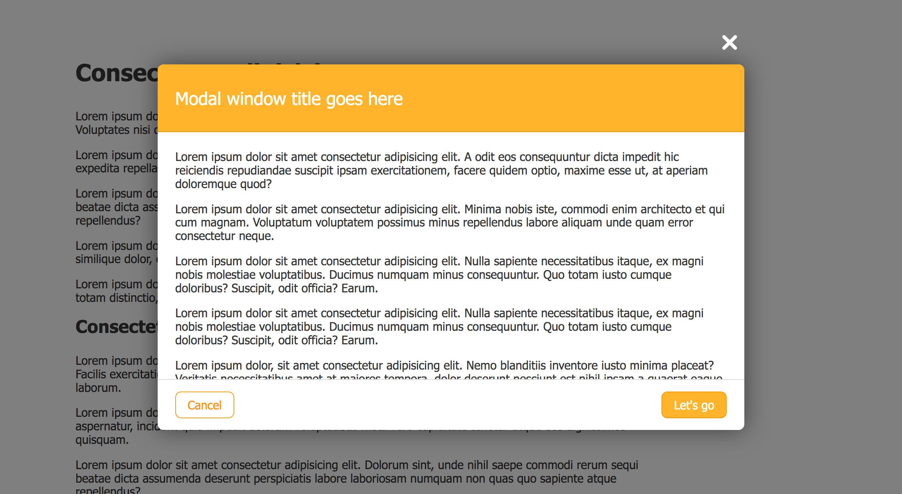
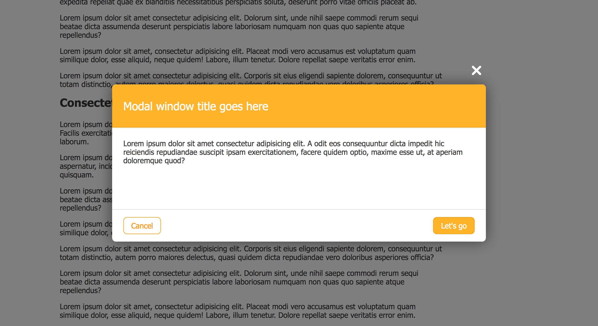
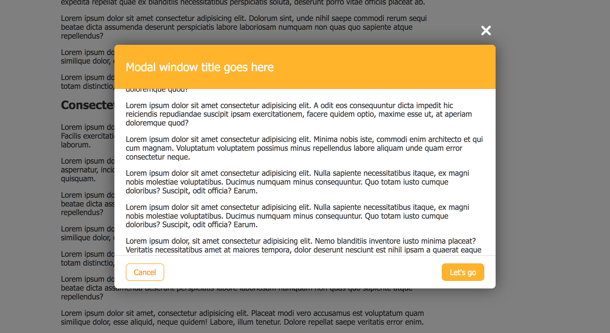
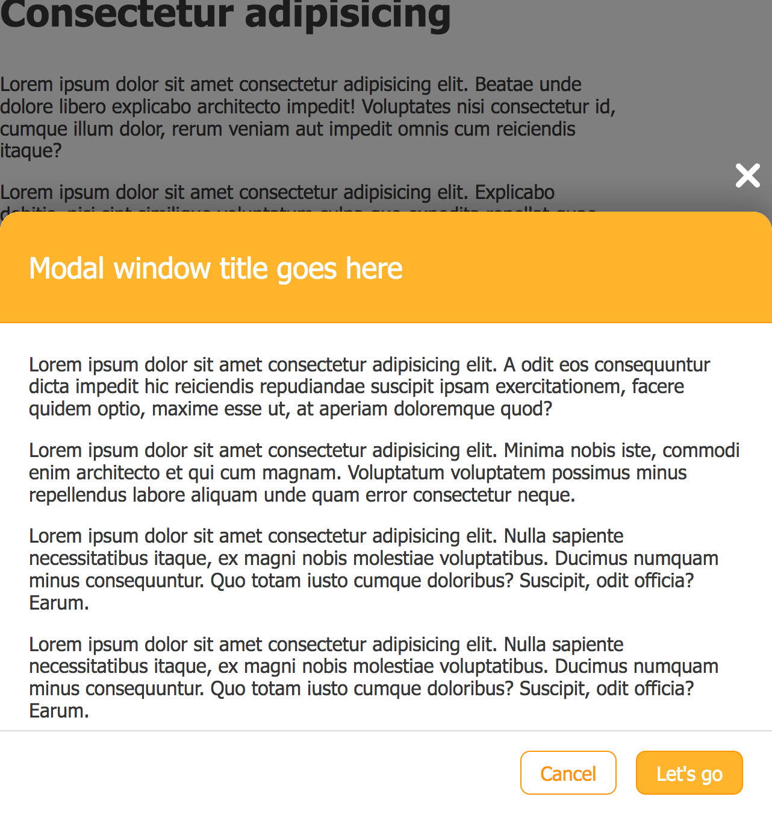
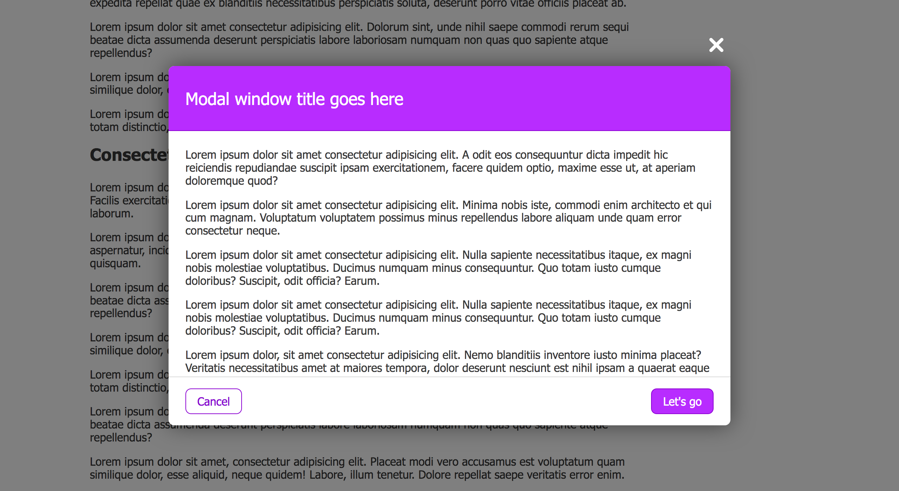
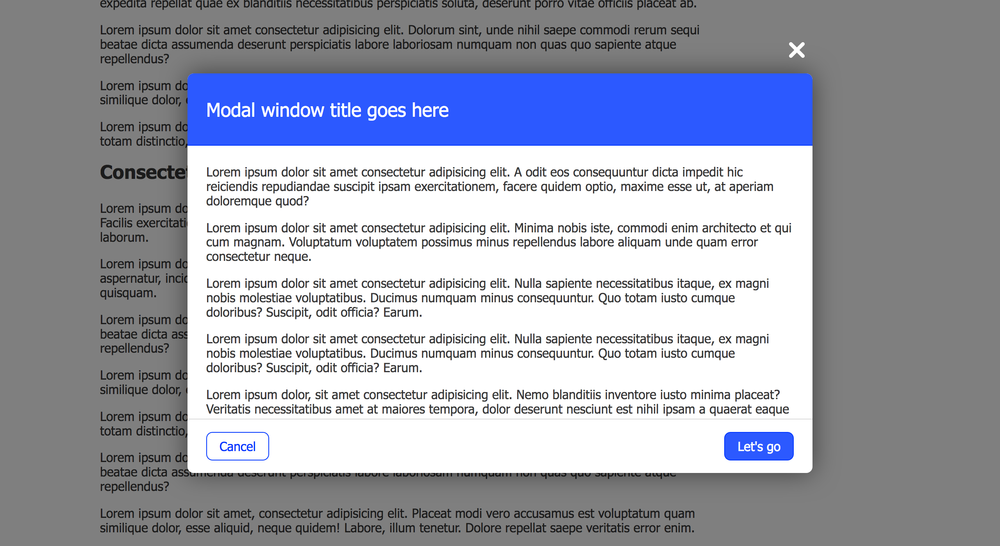
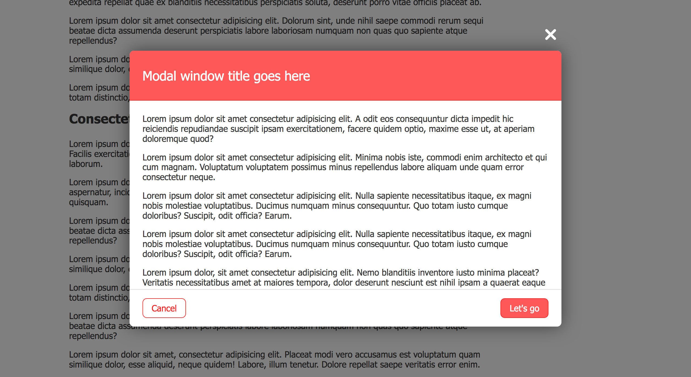

# Modal window

# Desktop

* The modal is centered horizontally and vertically
* There is a darker overlay, so the content below cannot be selected
* When the content below is scrolled, the overlay is still covering the entire page

Take a look at the example:

* When there is too little content, the modal should not
become too narrow, take a look at the example:

* When there is too much content, the content of the modal is scrollable, but the header and footer remain visible, take a look at the example:

# Mobile

The modal is reponsive!
* It appears at the bottom of the window.

# Theme it

How can you easily theme the modal?

